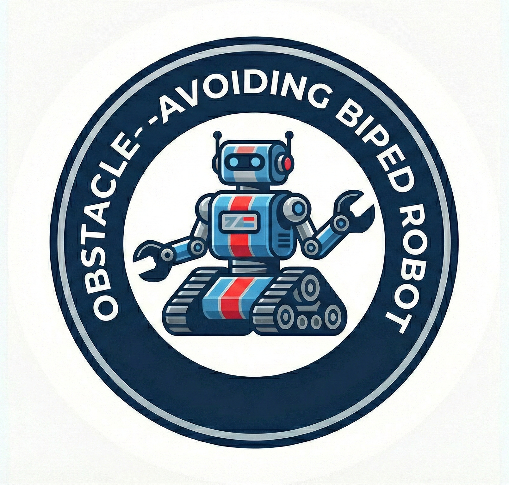

# Obstacle-Avoiding Biped Robot

<p align="center">
  
</p>

<p align="center">
  An autonomous bipedal walking robot that detects and avoids obstacles using infrared sensors.
</p>

<p align="center">
  <b>Master 1 ESTEL — Robotics Project — 2020/2021</b>
</p>

---

## About the Project

Built as part of the Robotics module in the Master 1 ESTEL program (2020/2021), this bipedal robot walks autonomously and navigates around obstacles using two Sharp infrared distance sensors and four servo-driven leg joints.

**Authors:** CHEGGOUR Selina, GOUFFI Djamel, MBOCK Therese
**Advisor:** RIBERO Jean-Marc

The full academic report is available at [`docs/report.pdf`](docs/report.pdf).

## How It Works

The robot reads both IR sensors each loop cycle and selects one of four behaviors:

| Condition | Behavior | Detail |
|-----------|----------|--------|
| No obstacle (both > 20 cm) | Walk forward | Alternating right/left leg gait |
| Right sensor ≤ 20 cm only | Turn left | Buzzer alert, step right leg only |
| Left sensor ≤ 20 cm only | Turn right | Buzzer alert, step left leg only |
| Both sensors ≤ 20 cm | Reverse + turn | Buzzer alert, 4 steps backward, re-scan, turn toward clearer side |

## Hardware Requirements

| Component | Description |
|-----------|-------------|
| Arduino UNO | Microcontroller board |
| Sensor Shield v5.0 | EasyCard — simplifies servo/sensor wiring |
| Sharp GP2Y0A21YK0F (x2) | Infrared distance sensors (10–80 cm) |
| Servo motors (x4) | Two per leg (upper joint + lower joint) |
| Battery 6V 1600mAh | LRP XTEC RX-Pack NiMH |
| Piezoelectric buzzer | Obstacle alert sound |
| LEDs (x2) | Status indicators |
| Toggle switch | Power on/off |
| Bipedal robot chassis | Mechanical frame with aluminum mounts |

## Pin Configuration

| Component | Pin | Direction |
|-----------|-----|-----------|
| Right upper servo | 4 | Output |
| Left upper servo | 5 | Output |
| Right lower servo | 6 | Output |
| Left lower servo | 7 | Output |
| Buzzer | 8 | Output |
| Right IR sensor | A0 | Input |
| Left IR sensor | A1 | Input |
| Right LED | 12 | Output |
| Left LED | 13 | Output |

## Project Structure

```
obstacle-avoiding-biped-robot/
├── README.md
├── .gitignore
├── src/
│   └── CodeRebot/
│       └── CodeRebot.ino            ← main production sketch
├── calibration/
│   ├── forward_walk/
│   │   └── forward_walk.ino         ← test forward gait only
│   ├── reverse_walk/
│   │   └── reverse_walk.ino         ← test reverse gait only
│   ├── ir_sensor_test/
│   │   └── ir_sensor_test.ino       ← read IR distances via Serial
│   └── buzzer_test/
│       └── buzzer_test.ino          ← test buzzer output
└── docs/
    ├── report.pdf                   ← full academic report (28 pages)
    └── images/
        └── logo.svg
```

## Getting Started

### Dependencies

- **Servo** — built-in Arduino library
- **SharpIR** — install via the Arduino Library Manager (search "SharpIR")

### Arduino IDE

1. Open `src/CodeRebot/CodeRebot.ino` in the Arduino IDE
2. Select **Board → Arduino UNO** and the correct port
3. Click **Upload**

### Arduino CLI

```bash
# Compile
arduino-cli compile --fqbn arduino:avr:uno src/CodeRebot/CodeRebot.ino

# Upload (adjust port as needed)
arduino-cli upload -p /dev/ttyACM0 --fqbn arduino:avr:uno src/CodeRebot/CodeRebot.ino
```

## Calibration Sketches

Individual test sketches extracted from the project report. Upload them one at a time to tune specific subsystems:

| Sketch | Purpose | Output |
|--------|---------|--------|
| `calibration/forward_walk/` | Tune forward gait servo angles | Visual (robot walks) |
| `calibration/reverse_walk/` | Tune reverse gait servo angles | Visual (robot walks backward) |
| `calibration/ir_sensor_test/` | Verify IR sensor readings | Serial Monitor (cm) |
| `calibration/buzzer_test/` | Verify buzzer wiring | Audible pulse every 1s |

## Documentation

- **[Full Academic Report](docs/report.pdf)** — System design, GRAFCET, component analysis, circuit simulations, and code walkthrough (28 pages, French).

## License

This project is licensed under the [MIT License](LICENSE).
